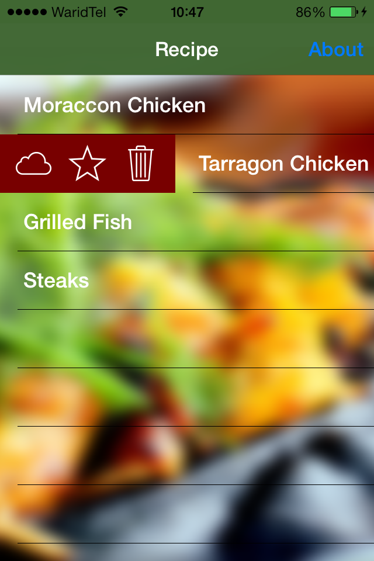

# Requirement

WZSwipe Cell requires Xcode 5, targeting iOS 7.0  

# Usage

Just drag the Recipe Cell and LeftGesture View to your project.

### RecipeViewController

Apply the gesture recognizer on the Table View to get the rect of the swiped cell and apply action according to taped particular rect.

##### TableView Gesture

	self.tap = [[[UITapGestureRecognizer alloc] initWithTarget:self action:@selector(didTapOnTableView:)] autorelease];
    [self.recipeTableView addGestureRecognizer:self.tap];

##### TableView Gesture Handler

Convert  the coordinate of LeftGestureView to RecipeTableView coordinate system same for the buttons
	
	- (void) didTapOnTableView:(UIGestureRecognizer*) recognizer {
    
	    CGPoint tapLocation = [recognizer locationInView:self.recipeTableView];
	    NSIndexPath *indexPath = [self.recipeTableView indexPathForRowAtPoint:tapLocation];
	    
	    if (indexPath)
	    {
	        // we are in a tableview cell, let the gesture be handled by the view
	        recognizer.cancelsTouchesInView = NO;
	    }
	    
	    if ([indexPath compare:self.previousIndexPath] != NSOrderedSame)
	    {
	        return;
	    }
	    
	    RecipeCell *recipeCell = (RecipeCell*) [self.recipeTableView cellForRowAtIndexPath:self.previousIndexPath];
	    LeftGestureView *leftGestureView = [recipeCell leftGestureView];
	    
	    CGRect gestureRect = [recipeCell convertRect:leftGestureView.frame toView:self.recipeTableView];
	
	    if (CGRectContainsPoint(gestureRect, tapLocation))
	    {
	        CGRect shareRect   = [leftGestureView convertRect:leftGestureView.btnShare.frame toView:self.recipeTableView];
	        
	        if (CGRectContainsPoint(shareRect, tapLocation))
	        {
	            // Customize the Button Event
	           
	        }
	    }
    }
# Credits

WZSwipeCell was created By Waqar Zahour. you can contact through this email waqar.zahour@gmail.com

